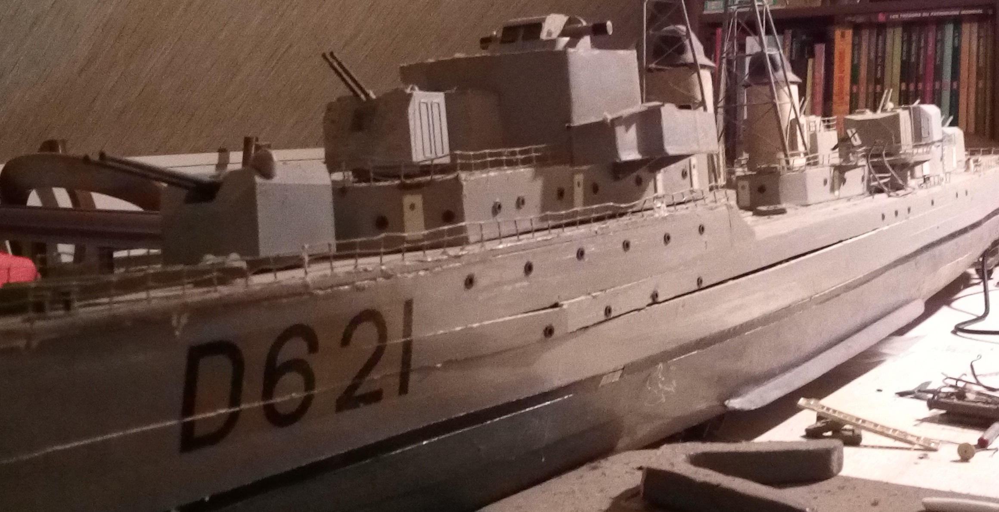

# d621_C

This software is used to drive my model of D621 warship, by xbox360 controller and C software.



## [Controller](https://github.com/ox223252/Xbox360-wireless/blob/master/README.md):

## How to use:

Connect the controller and start the software

```C
./bin/d621 -h
```

### Parameters:

| long    | short | default arg | other args | comment                               |
|:-------:|:-----:| ----------- | ---------- |:------------------------------------- |
| --help  | -h    | XXXXXXXXXXX | XXXXXXXXXX | display avalable cmds                 |
| --dir   | -d    | left        | right      | direction joystick position on keypad |
| --speed | -s    | left        | right      | speed joystick  position on keypad    |
| --cam   | -c    | right       | left       | camera joystick position on keypad    |
